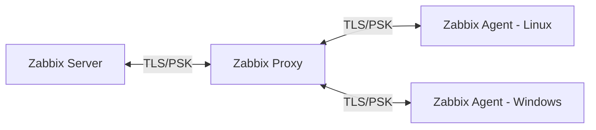

# Zabbix Labs / Proxy + Hosts Remotos

Repositório público para documentar meus laboratórios de *Monitoring & Observability* com **Zabbix** (Proxy, Agent, TLS, automação e boas práticas).  
Este projeto serve como **portfólio técnico** e guia reproduzível.

> **Stack**: Zabbix, Debian/Ubuntu, MySQL/MariaDB, Bash, GitHub Actions.

## Estrutura
```
zabbix-labs-portfolio/
├─ labs/
│  └─ LAB-03/                # Instalação e Config do Zabbix Proxy + Agent
│     ├─ README.md           # Passo a passo com prints e validações
│     └─ evidence/           # Screenshots, topologia e outputs
├─ scripts/                  # Automação (instalação, checagens, helpers)
├─ configs/                  # Arquivos .conf de exemplo
├─ docs/                     # Diagramas, notas extras
├─ .github/workflows/        # CI (ex: ShellCheck)
├─ LICENSE
└─ CONTRIBUTING.md
```
## Como usar
- **Clonar**: `git clone https://github.com/<seu-usuario>/zabbix-labs-portfolio.git`
- **Rodar script** (ex.: instalar Proxy): `sudo bash scripts/install_zabbix_proxy.sh`
- **Publicar evidências**: adicione prints em `labs/LAB-03/evidence/` e referencie no `README` do lab.

## Roadmap
- [x] LAB-03 – Zabbix Proxy + Agent + TLS
- [ ] LAB-XX – Discovery + Templates
- [ ] LAB-XX – Grafana + Datasource Zabbix
- [ ] LAB-XX – Alerting (Email, Webhook)

## Diagrama (Mermaid)

